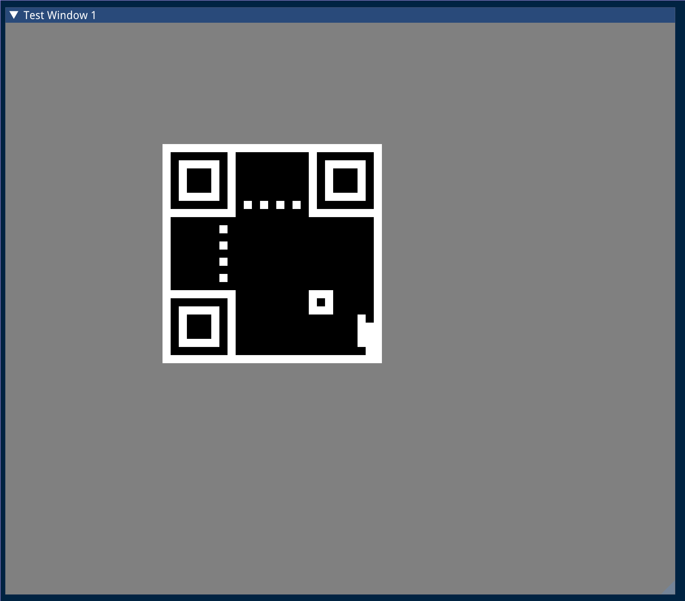

# :cd: Quick Response (QR) Code Version 2 Utility
This is an implementation of a QR code utility used for generating QR codes
given some ascii text input by the user.

# :hammer: Current Progress
This implementation is using the [imgui](https://github.com/ocornut/imgui)
library to visualize QR codes. Currently the subset of the QR code version 2
specification produced are as follows:
  - Those spaces which are required for orientation.
  - The data type (Numeric, Alpha-Numeric, Binary, and Japanese Kanji).
  - The size of the message to be encoded.

Here is the current interface of the program:


For a road-map of how this project is going to progress, please see the
[issues tab](https://github.com/millipedes/QR-Utility/issues).

# :floppy_disk: Making the Project
This project uses `cmake` as its build infrastructure. To get `cmake` via the
`apt` package manager:
```
sudo apt update && sudo apt upgrade
sudo apt install cmake make
```

Building this project uses the following libraries:
  - gl1-mesa
  - glfw3
  - sdl2
  - gtest
  - tl/expected

To install these with the `apt` package manager:
```
sudo apt update && sudo apt upgrade
sudo apt install libgl1-mesa-dev libglfw3-dev libsdl2-dev libgtest-dev libexpected-dev
```

To build the project you execute the following commands in bash:
```
# to get the imgui submodule
git submodule update --init --recursive
mkdir build
cd build
# if you do not want to build the tests you can put put the flag:
# -DBUILD_TESTS=OFF
cmake ..
make
```
